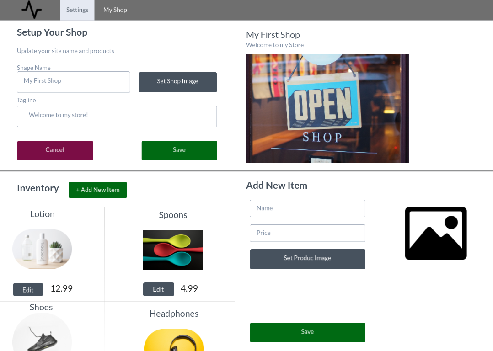
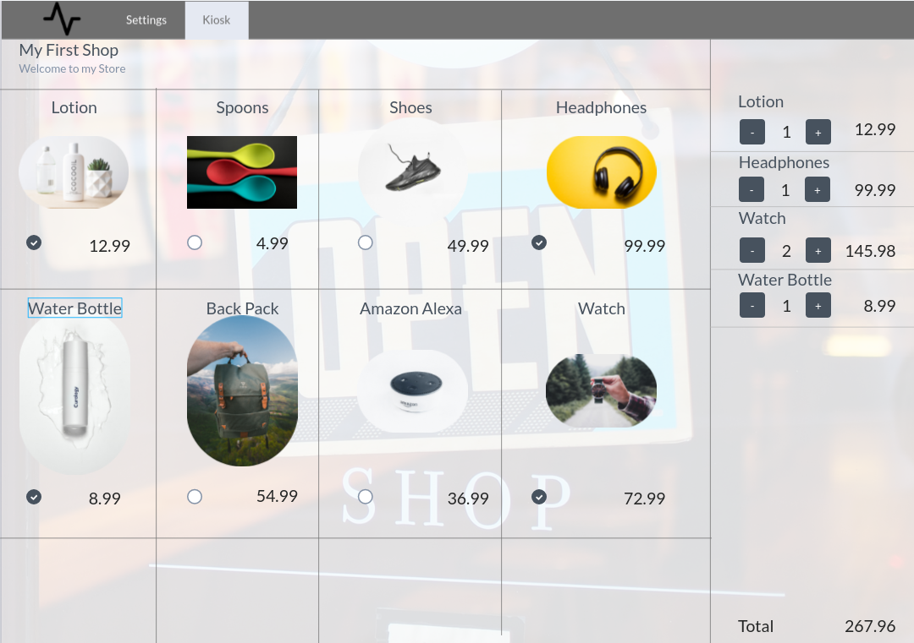

# Lets make a website

This will be a very limited, pure html/css/js project, aimed at helping you practice the basics:

1. HTML/CSS for the basic layout
2. Basic forms and JS.
3. Data Persistance with [local storage](https://developer.mozilla.org/en-US/docs/Web/API/Window/localStorage)
4. More advanced javascript rendering.

## Point of sale!

A two page site, for creating a point of sale.

### Reference Images:

Settings Page:

Kiosk Page:


### What this website will do:

1. Allow a user to create a "shop".
2. Allow a user to manage the shop name, image, tagline, and inventory.
3. Allow a user to change their color scheme.
4. Allow a user to "view shop in kiosk mode"
   1. While in kiosk mode, a user should be presented with a grid of all their inventory
   2. There should be a cart, where selected items are listed.
   3. the cart should have a quantity input.
   4. The cart should sum up all the products.
   5. Touching anywhere in the square for a product should add 1 to the cart.
   6. If you minus from a product in the cart, and it gets to 0, it should be removed from the list.

## Developing

1. open terminal.
2. `cd` to where you want to clone this project.
3. clone this repo using `git clone git@github.com:thewooleyway/lets-make-a-website.git`
4. run `cd lets-make-a-website` in your terminal
5. open that folder with vs-code.
6. run `open src/index.html` in your terminal, which should open a blank page in your browser.
7. As you edit the html, css, and js files in vscode, hit refresh in your browser to see your changes.
8. You may find a tutorial on development tools helpful. Some thing like [this video](https://www.youtube.com/watch?v=wcFnnxfA70g)

## Recommended steps for creating this site.

### Step 1.

1. open src/index.html and create everything that will be on both pages. (menu)
   1. link the main.css file.
2. copy src/index.html to src/settings.html
3. create the content on each page, exactly as seen in the images, using just html and css. Use images from the internet for product images.
4. Edit the menu sections so that you can navigate to each page from the other page.
   1. clicking settings in index.html should bring you to the settings page, and clicking kiosk in the settings page should bring you to index.html
   2. The links should look something like
   ```html
   <a href="./index.html">Kiosk</a>
   <!-- relative paths -->
   ```
5. Once you are happy with how things look, make a js file `settings.js`.
6. include the `settings.js` file in the `settings.html` page.
7. Use javascript to detect when a user types into the store name and input field, modify the preview on the right side of the page, so that the name updates as they type.
8. Do the same with tagline field.
   1. The image might be a bit trickier, so you can try to make that work, but I would skip that for now.
9. Save those settings to [local storage](https://developer.mozilla.org/en-US/docs/Web/API/Window/localStorage) whenever they type.
10. Modify your javascript so that when the page first loads, the input defaults to what is in local storage.

### Step 2.

Looks like you have a good grip on html, css, and js! A lot of websites actually don't get too much more complicated than this (blogs, business websites etc...)! But we are not done yet, we are making a kiosk, and it's going to change the world!

Step 2 is when things will get a lot more tricky, because you need to keep track of a list of products, and those products need to be editable.

1. settings.js create a products array. Filling out the Add new product form should add a new product to the array. a product should be an object that looks like this

```js
{
    name: "product name",
    price: 4.99,
    image: "https://i.imgur.com/3hoivVu.png"
}
```

2. Note that we still haven't learned to deal with images, so for now, we will always just use one hosted by imagur. If you want, instead of an upload Image button, you could make it a text field where someone can set an image url.
3. When a user clicks edit on a product. The text in the "add new item" form, should change too "Edit Product". and the details of that that product should overwrite what is in the form.
4. When the user clicks save, the product that they were editing should be updated.
5. When they click "Add new Item" the form should become blank, and the text should change back to "Add new Item" for the form again. Now hitting save should add a new item.
6. Whenever a product is edited or saved, you should save it in local storage.

`hint: lookup JSON.stringify and JSON.parse for easier ways to store and get back your product array`

### Step 3.

Wow! If you made it this far before I got back from prague, that is amazing! And you probably don't need my guidance too much anymore.

But here is what you need to do in very broad strokes.

1. Read your products back from localStorage in the kiosk page.
2. Use that product data to create the product grid.
3. When someone clicks the product in the grid, write a line into the cart summary section.
